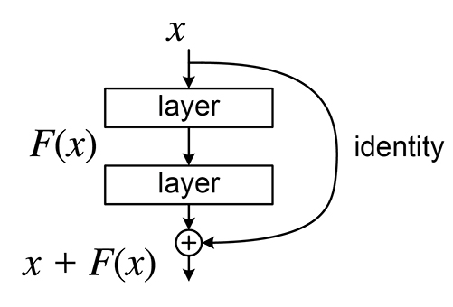
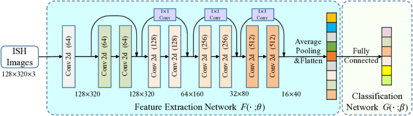

# ResNet with PyTorch 

In this repo along with PyTorch training course, I want to implement ResNet deep learning network model.

## What is ResNet model?

ResNet (Residual Network) is a type of deep neural network introduced by Kaiming He and his colleagues in 2015. It was designed to address issues like decreasing accuracy and instability that occur in very deep networks.

## How to work?
● Residual Blocks: In ResNet, instead of learning the direct mapping, the network learns the "residual" or the difference between the input and output. This is done using skip connections that add the output of one layer to the output of a subsequent layer. These connections allow the original input information to be transferred directly to later layers.

_ResNet Block_

● Skip Connections: These connections transfer the output of one layer to the next layer by directly adding the input and output of a layer. This improves the gradient flow and prevents the problem of vanishing gradients in very deep networks, allowing the network to retain important information.
_ReNet Model_

